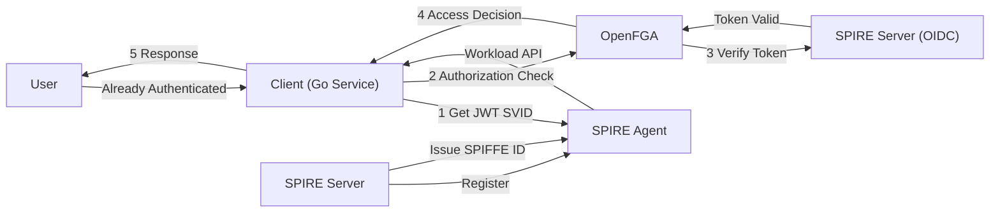

# SPIRE + OpenFGA 統合プロジェクト

## プロジェクト概要

本プロジェクトは、SPIRE（SPIFFE Runtime Environment）とOpenFGAを統合し、ゼロトラストセキュリティモデルに基づく認可システムを構築します。

## コンポーネント構成

- **Client (Go)**: アプリケーションサービス（ユーザー認証済みを前提）
- **SPIRE Server**: SPIFFE ID発行・管理
- **SPIRE Agent**: Workload API提供
- **OpenFGA**: 認可サービス
- **OIDC Provider**: SPIRE Server

## OpenFGA認証フロー

1. ClientがSPIRE AgentからJWT SVIDを取得
2. JWT SVIDをOpenFGAへの認証トークンとして使用（ClientがOpenFGAにアクセスするための認証）
3. OpenFGAがOIDC Provider（SPIRE Server）でトークンを検証

## 認可フロー（デモシナリオ）

1. Client側でユーザー認証済みを前提とする（デモでは認証済みとして扱う）
2. Clientが「aliceがwonderlandにアクセス可能か」をOpenFGAに問い合わせ
3. OpenFGAがアクセス制御モデルに基づいて判定
4. 結果をClientに返却

## ディレクトリ構成

```
openfga/
├── client/          # Goサービス
├── spire-config/    # SPIRE設定
├── openfga-config/  # OpenFGA設定
└── docker-compose.yml  # 統合環境
```

## システムアーキテクチャ



## デモの前提条件

- ユーザー認証はClient側で完了していると仮定
- SPIREはClient→OpenFGA間の認証のみを担当
- OpenFGAがユーザーの認可判定を実施

## 主な特徴

- **サービス間認証**: SPIREによるClient-OpenFGA間の相互認証
- **細粒度の認可制御**: OpenFGAによる柔軟なアクセス制御
- **標準準拠**: SPIFFE/SPIREおよびOIDC標準に準拠
- **デモ簡略化**: ユーザー認証部分は実装せず、認可に焦点
